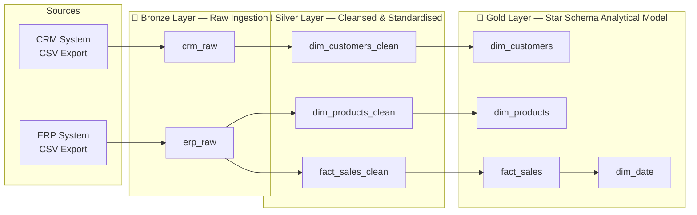

# SQL Server Data Warehouse — Medallion Architecture

An end-to-end data warehouse implementation using Microsoft SQL Server,
structured around the Bronze → Silver → Gold medallion pattern — the same
architecture used in cloud platforms like Databricks/Delta Lake, implemented
here on-premises in T-SQL.

Built to formalize data engineering patterns applied in production and to
demonstrate warehouse design thinking independent of any specific cloud tooling.

---

## Architecture Overview



---

## Design Decisions

### Why Medallion Architecture?
The three-layer separation (Bronze → Silver → Gold) solves a practical problem:
raw source data is messy, business logic changes, and reprocessing from scratch
is expensive. By landing raw data untouched in Bronze, transformations in Silver
are auditable and rerunnable. The Gold layer remains stable for BI consumers
regardless of upstream changes.

This mirrors the Delta Lake pattern in Databricks — same architectural contract,
different execution engine.

### Why Star Schema in Gold?
Flat or normalised models force BI tools to resolve joins at query time, which
degrades performance at scale. Star schema pre-resolves entity relationships into
dimension tables, reducing analytical query complexity and enabling efficient
aggregations across large fact tables. Conformed dimensions (customers, products,
date) also allow future fact tables to be added without breaking existing reports.

### Deduplication Strategy
Referenced entities (customers, shipping locations, products) are deduplicated
in the Silver layer before promotion to Gold — ensuring each entity appears
exactly once in dimension tables. This prevents fan-out in aggregations and is
a prerequisite for accurate KPI calculation.

---

## Repository Structure
```
SQL-DW-Project/
├── datasets/          # Sample source data (ERP + CRM CSV exports)
├── scripts/
│   ├── bronze/        # Raw ingestion DDL and load scripts
│   ├── silver/        # Cleansing, standardisation, deduplication
│   └── gold/          # Star-schema DDL and final model population
├── tests/             # Data quality validation queries
└── docs/              # Data catalog, naming conventions, data lineage
```
---

## Tech Stack

| Component | Technology |
|---|---|
| Database Engine | Microsoft SQL Server (local instance) |
| Query Language | T-SQL |
| ETL Logic | Stored procedures + SQL scripts |
| Data Quality | Validation queries in `/tests` |
| Documentation | Data catalog in `/docs` |

---

## Data Catalog & Documentation

The `/docs` folder contains:
- **Data catalog** — table descriptions, column definitions, business logic
- **Naming conventions** — consistent naming standard across all three layers
- **Data lineage** — source-to-Gold transformation map

Documentation is treated as a first-class deliverable, not an afterthought —
reflecting production practice where undocumented pipelines create operational
risk.

---

## Analytical Layer — Key Metrics

SQL-based analytics over the Gold layer, covering:

- **Customer behaviour** — purchase frequency, recency, revenue contribution
- **Product performance** — sales volume, margin trends, category analysis
- **Sales trends** — time-series aggregations at daily, monthly, and yearly
  granularity

---

## Context

This project formalises data engineering patterns I've applied in production:
at Vestas I designed and owned end-to-end ETL pipelines processing millions
of rows of SCADA turbine data into financial KPIs, built on the same Bronze →
Silver → Gold separation implemented here. This repo is the explicit,
documented version of that architectural thinking.
